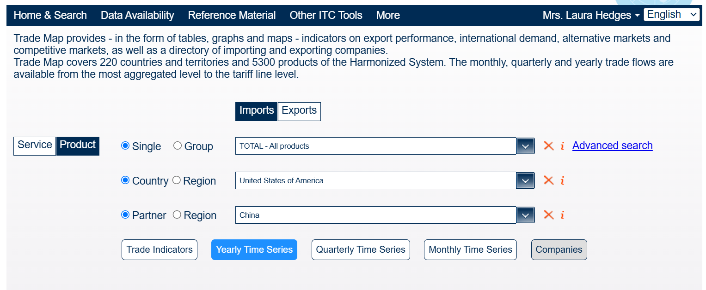
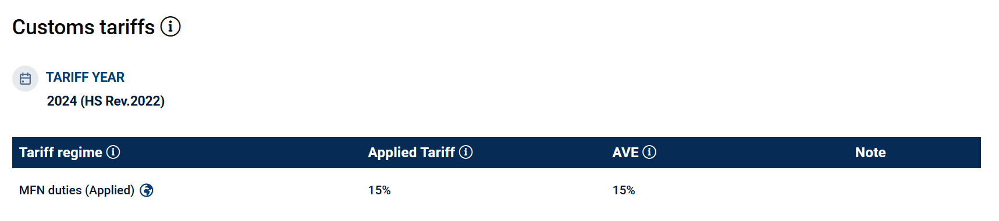

## Tracking and Visualising Global Trade Data with AI Tools:
When assessing international trade issues, the Treasury often needs to be able to track and visualise trade flows of goods and services, as well as trade barriers applied by different trading partners.
Current trade data sources require painfully manual processes to collect and summarise bilateral trade flows and tariff rates. 
The challenge is to be able to create a pipeline which is able to automatically pull user-specified trade data from the public data sources and visualise the results. 
Accessibility of data and flexibility in visualisations of trade networks are critical.

### Data Available

•	[Trade map](https://www.trademap.org/Index.aspx) – it would be useful to have annual bilateral trade flows at HS6 level (and total) of goods between all countries, if possible, if not at least those in the G20 and aggregated regions such as EU, CPTPP, GCC, G7 (blocs of interest [here](https://www.gov.uk/guidance/uk-trade-agreements-in-effect)). 

•	[Mac map](https://www.macmap.org/) – for same regions as above, the import duty (AVE) and trade remedies measure highlighted below if applicable (example [query](https://www.macmap.org/en//query/results?reporter=156&partner=842&product=870321&level=6))

•	[HMRC bulk datasets](https://www.uktradeinfo.com/trade-data/latest-bulk-datasets/) – exports, imports and import data by preference for all countries.

•	[ONS trade](https://www.ons.gov.uk/economy/nationalaccounts/balanceofpayments/datasets/uktotaltradeallcountriesseasonallyadjusted) – annual total trade, TiG, TiS

#### Return [home](index.md)
